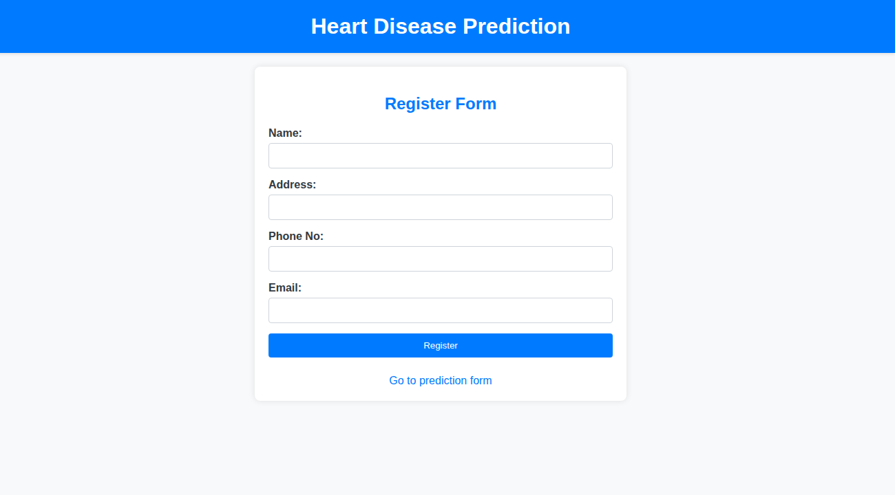
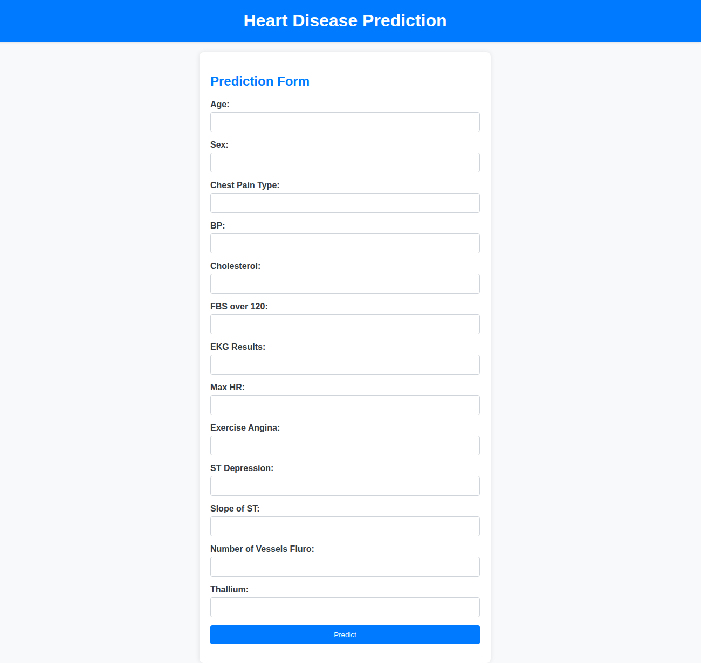
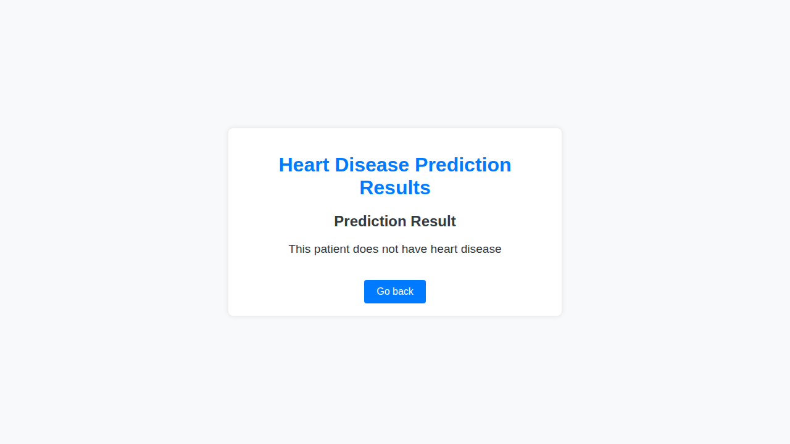

# Heart Disease Prediction Website with CI/CD

A comprehensive web application for predicting heart disease risk using machine learning. This project combines a Flask web application with a trained neural network model, MongoDB for data storage, and automated CI/CD pipelines for seamless deployment to Azure.

## 🌐 Live Demo

The application is deployed on Azure Web Apps and accessible at:
**[https://hdpapp.azurewebsites.net](https://hdpapp.azurewebsites.net)**

[](https://github.com/Sikandarh11/Heart-Disease-Prediction-Website-CICD/actions)

## 📋 Table of Contents

- [Live Demo](#-live-demo)
- [Features](#-features)
- [Project Architecture](#-project-architecture)
- [Quick Start](#-quick-start)
- [Usage Guide](#-usage-guide)
- [Machine Learning Model](#-machine-learning-model)
- [Database Schema](#-database-schema)
- [API Endpoints](#-api-endpoints)
- [CI/CD Pipeline](#-cicd-pipeline)
- [Development](#-development)
- [Security Considerations](#-security-considerations)
- [Troubleshooting](#-troubleshooting)
- [Monitoring & Logging](#-monitoring--logging)
- [Contributing](#-contributing)
- [License](#-license)
- [Contact & Support](#-contact--support)
- [Future Enhancements](#-future-enhancements)

## 🌟 Features

- **User Registration System**: Secure patient registration with personal information storage
- **Heart Disease Prediction**: ML-powered risk assessment using clinical parameters
- **Responsive Web Interface**: Clean, user-friendly forms with Bootstrap-style design
- **Data Persistence**: MongoDB integration for storing user profiles and prediction results
- **Containerized Deployment**: Docker support for easy deployment and scaling
- **CI/CD Pipeline**: Automated testing, building, and deployment to Azure Web Apps
- **Real-time Results**: Instant prediction results with detailed explanations

## 🏗️ Project Architecture

```
Heart-Disease-Prediction-Website-CICD/
├── app.py                      # Main Flask application
├── requirements.txt            # Python dependencies
├── Dockerfile                  # Container configuration
├── heart_disease_model.h5      # Pre-trained Keras model
├── scaler.pkl                  # Feature scaling model
├── templates/                  # HTML templates
│   ├── register.html          # User registration form
│   ├── index.html             # Heart disease prediction form
│   └── result.html            # Prediction results display
└── .github/workflows/          # CI/CD pipeline configurations
    ├── ci-cd.yml              # General CI/CD workflow
    └── main_hdpapp.yml        # Azure deployment workflow
```

## 🚀 Quick Start

### Prerequisites

- **Python 3.8 or higher** 🐍
- **Docker** (optional, for containerized deployment) 🐳
- **MongoDB connection string** (MongoDB Atlas recommended) 🗄️
- **Azure account** (for cloud deployment) ☁️

### Local Installation

1. **Clone the repository:**
   ```bash
   git clone https://github.com/Sikandarh11/Heart-Disease-Prediction-Website-CICD.git
   cd Heart-Disease-Prediction-Website-CICD
   ```

2. **Create a virtual environment (recommended):**
   ```bash
   python -m venv venv
   source venv/bin/activate  # On Windows: venv\Scripts\activate
   ```

3. **Install dependencies:**
   ```bash
   pip install -r requirements.txt
   ```

4. **Configure MongoDB:**
   - Update the MongoDB connection string in `app.py` (line 7)
   - Or set as environment variable:
     ```bash
     export MONGO_CONNECTION_STRING="your_mongodb_connection_string"
     ```

5. **Verify model files exist:**
   ```bash
   ls -la heart_disease_model.h5 scaler.pkl
   ```

6. **Run the application:**
   ```bash
   python app.py
   ```

7. **Access the application:**
   - Open your browser and navigate to `http://localhost:80`
   - Or `http://localhost:8080` if you modified the port

### Docker Deployment

#### Option 1: Build and Run Locally
1. **Build the Docker image:**
   ```bash
   docker build -t heart-disease-prediction .
   ```

2. **Run the container:**
   ```bash
   docker run -p 80:80 \
     -e MONGO_CONNECTION_STRING="your_mongodb_connection_string" \
     heart-disease-prediction
   ```

#### Option 2: Using Docker Compose (Recommended)
Create a `docker-compose.yml` file:
```yaml
version: '3.8'
services:
  web:
    build: .
    ports:
      - "80:80"
    environment:
      - MONGO_CONNECTION_STRING=your_mongodb_connection_string
    restart: unless-stopped
```

Then run:
```bash
docker-compose up -d
```

### Environment Configuration

The application supports the following environment variables:

| Variable | Description | Default | Required |
|----------|-------------|---------|----------|
| `MONGO_CONNECTION_STRING` | MongoDB Atlas connection string | Hardcoded in app.py | Yes |
| `FLASK_ENV` | Flask environment mode | production | No |
| `PORT` | Application port | 80 | No |
| `DEBUG` | Enable debug mode | False | No |

#### Setting up MongoDB Atlas (Free Tier)

1. Create account at [MongoDB Atlas](https://www.mongodb.com/cloud/atlas)
2. Create a new cluster (M0 Sandbox - Free)
3. Configure database access (username/password)
4. Configure network access (IP whitelist or 0.0.0.0/0 for development)
5. Get connection string from "Connect" → "Connect your application"
6. Replace `<password>` and `<dbname>` in the connection string

## 📱 Usage Guide

### Step 1: User Registration
Navigate to the homepage and register with your personal information.



- Fill in your personal information:
  - Full Name
  - Address
  - Phone Number
  - Email Address
- Click "Register" to create your profile

### Step 2: Heart Disease Risk Assessment
After registration, you'll be redirected to the prediction form where you need to provide clinical parameters.



#### Clinical Parameters:
- **Age**: Patient's age in years
- **Sex**: Gender (1 = male, 0 = female)
- **Chest Pain Type**: Type of chest pain (0-3 scale)
- **BP**: Resting blood pressure (mm Hg)
- **Cholesterol**: Serum cholesterol level (mg/dl)
- **FBS over 120**: Fasting blood sugar > 120 mg/dl (1 = true, 0 = false)
- **EKG Results**: Resting electrocardiographic results (0-2 scale)
- **Max HR**: Maximum heart rate achieved
- **Exercise Angina**: Exercise-induced angina (1 = yes, 0 = no)
- **ST Depression**: ST depression induced by exercise
- **Slope of ST**: Slope of peak exercise ST segment (0-2 scale)
- **Number of Vessels Fluro**: Number of major vessels colored by fluoroscopy (0-3)
- **Thallium**: Thallium stress test result (0-3 scale)

### Step 3: View Results
The system will analyze your data using the trained ML model and display the results.



- Results are displayed with a clear indication of heart disease risk
- All data is securely stored in the database for future reference
- Use the "Go back" button to make another prediction

## 🤖 Machine Learning Model

### Model Details
- **Architecture**: Deep Neural Network built with TensorFlow/Keras
- **Input Features**: 13 clinical parameters
- **Output**: Binary classification (Heart Disease Risk: Yes/No)
- **Preprocessing**: Feature scaling using StandardScaler
- **Model File**: `heart_disease_model.h5`
- **Scaler File**: `scaler.pkl`

### Performance
The model has been trained on a comprehensive heart disease dataset and provides reliable predictions based on established clinical indicators.

## 🗄️ Database Schema

### User Collection (`userInfo`)
```json
{
  "_id": "ObjectId",
  "name": "String",
  "address": "String",
  "phone_no": "String",
  "email": "String"
}
```

### Patient Data Collection (`Heart_Disease_Patients_Data`)
```json
{
  "_id": "ObjectId",
  "age": "Number",
  "sex": "Number",
  "chest_pain_type": "Number",
  "bp": "Number",
  "cholesterol": "Number",
  "fbs_over_120": "Number",
  "ekg_results": "Number",
  "max_hr": "Number",
  "exercise_angina": "Number",
  "st_depression": "Number",
  "slope_of_st": "Number",
  "num_vessels_fluro": "Number",
  "thallium": "Number",
  "result": "String"
}
```

## 🔧 API Endpoints

| Method | Endpoint | Description |
|--------|----------|-------------|
| GET | `/` | Displays user registration form |
| POST | `/register` | Processes user registration |
| GET | `/main` | Displays heart disease prediction form |
| POST | `/predict` | Processes prediction request and returns results |

## 🚀 CI/CD Pipeline

### Automated Workflows

#### 1. General CI/CD Pipeline (`ci-cd.yml`)
- **Trigger**: Push/PR to main branch
- **Steps**:
  - Code checkout
  - Python environment setup
  - Dependency installation
  - Docker image building
  - Azure Container Registry push

#### 2. Azure Deployment Pipeline (`main_hdpapp.yml`)
- **Trigger**: Push to main branch
- **Steps**:
  - Docker image build and push to Azure Container Registry
  - Automated deployment to Azure Web App (`hdpapp`)
  - Production environment configuration

### Environment Variables & Secrets
- `AZURE_CREDENTIALS`: Azure service principal credentials
- `AzureAppService_ContainerUsername_*`: Azure Container Registry username
- `AzureAppService_ContainerPassword_*`: Azure Container Registry password
- `AzureAppService_PublishProfile_*`: Azure Web App publish profile

## 🛠️ Development

### Technology Stack
- **Backend**: Flask (Python)
- **Frontend**: HTML5, CSS3, Bootstrap-style responsive design
- **Database**: MongoDB Atlas
- **ML Framework**: TensorFlow/Keras
- **Containerization**: Docker
- **Cloud Platform**: Microsoft Azure
- **CI/CD**: GitHub Actions

### Dependencies
```
Flask==2.2.2
Flask-PyMongo==2.3.0
tensorflow==2.13.0
pandas==2.0.3
numpy>=1.22,<=1.24.3
scikit-learn==1.3.0
gunicorn==20.1.0
Werkzeug==2.2.3
```

### Local Development Setup
1. Fork the repository
2. Create a feature branch: `git checkout -b feature-name`
3. Make your changes and test locally
4. Commit your changes: `git commit -m "Description of changes"`
5. Push to your fork: `git push origin feature-name`
6. Create a Pull Request

## 🔒 Security Considerations

- MongoDB connection strings should be stored as environment variables
- Input validation is implemented for all form fields
- Error handling prevents sensitive information exposure
- Docker container runs with minimal privileges

## 🐛 Troubleshooting

### Common Issues and Solutions

#### 1. Model Files Not Found
**Error**: `Model file not found. Ensure the path is correct.`
**Solution**: Ensure `heart_disease_model.h5` and `scaler.pkl` are in the project root directory.

#### 2. MongoDB Connection Issues
**Error**: MongoDB connection timeouts or authentication failures
**Solution**: 
- Verify MongoDB Atlas connection string
- Check network access and IP whitelist settings
- Ensure database credentials are correct

#### 3. Docker Build Failures
**Error**: Package installation failures during Docker build
**Solution**:
- Ensure all required files are in the build context
- Check internet connectivity for package downloads
- Verify Python version compatibility

#### 4. Port Conflicts
**Error**: `Address already in use` when running locally
**Solution**: 
- Change the port in `app.py` from 80 to another port (e.g., 8080)
- Or stop any services using port 80

### Debugging Tips

1. **Enable Flask Debug Mode**: Set `debug=True` in `app.run()` for detailed error messages
2. **Check Logs**: Use `docker logs <container_name>` to view application logs
3. **Database Connection**: Test MongoDB connection separately before running the app
4. **Model Loading**: Verify TensorFlow/Keras installation and model file integrity

## 📊 Monitoring & Logging

- Application logs are available through Docker container logs
- Azure Web App provides built-in monitoring and diagnostics
- MongoDB operations are logged for debugging purposes

## 🤝 Contributing

1. **Fork the Project**
2. **Create a Feature Branch** (`git checkout -b feature/AmazingFeature`)
3. **Commit Changes** (`git commit -m 'Add some AmazingFeature'`)
4. **Push to Branch** (`git push origin feature/AmazingFeature`)
5. **Open a Pull Request**

### Code Style Guidelines
- Follow PEP 8 for Python code
- Use meaningful variable and function names
- Add comments for complex logic
- Ensure all tests pass before submitting PR

## 📝 License

This project is licensed under the MIT License - see the [LICENSE](LICENSE) file for details.

## 🙏 Acknowledgments

- Heart disease dataset contributors
- TensorFlow/Keras community
- Flask documentation and community
- Azure documentation and support

## 📞 Contact & Support

- **Project Maintainer**: [Sikandarh11](https://github.com/Sikandarh11)
- **Issues**: [GitHub Issues](https://github.com/Sikandarh11/Heart-Disease-Prediction-Website-CICD/issues)
- **Discussions**: [GitHub Discussions](https://github.com/Sikandarh11/Heart-Disease-Prediction-Website-CICD/discussions)

## 🔮 Future Enhancements

- [ ] User authentication and session management
- [ ] Historical prediction tracking for users
- [ ] Advanced ML model with increased accuracy
- [ ] API documentation with Swagger/OpenAPI
- [ ] Unit and integration tests
- [ ] Performance monitoring and analytics
- [ ] Multi-language support
- [ ] Mobile application companion

---

⭐ **Star this repository if you find it helpful!** ⭐